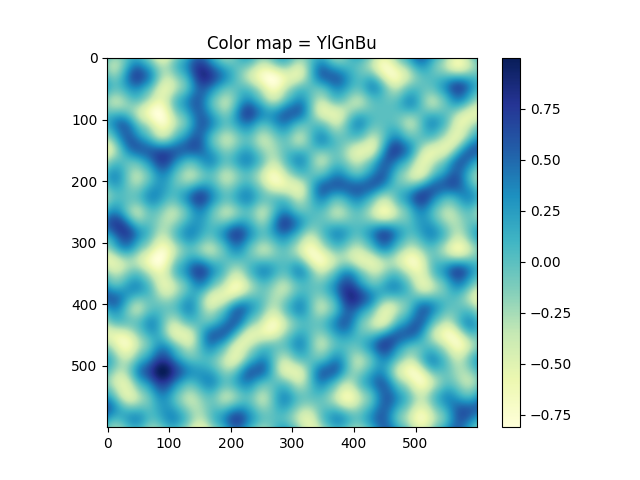
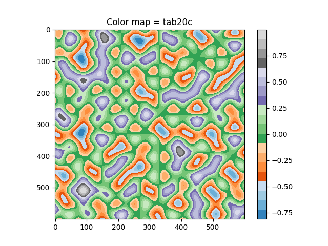
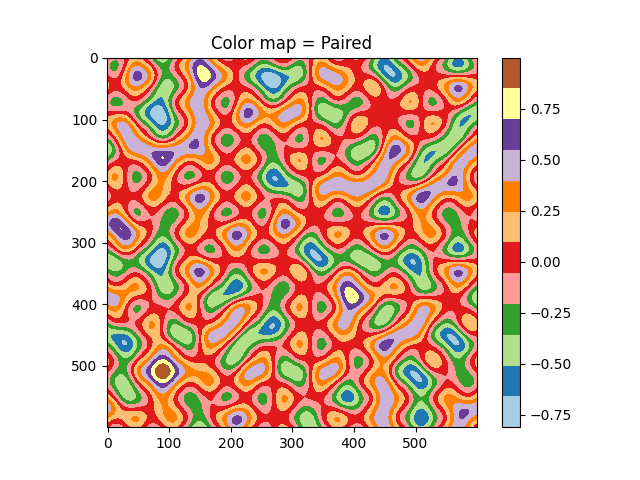
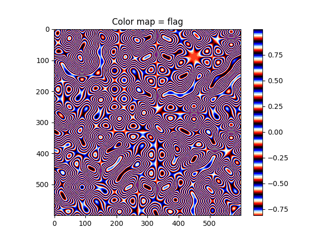
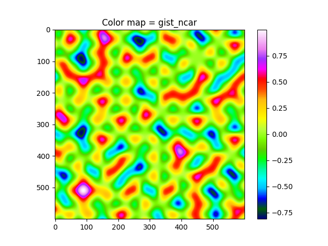

# [Perlin Noise](https://en.wikipedia.org/wiki/Perlin_noise)

Yes, it's another copy-paste of the original [improved Perlin Noise java code](https://mrl.cs.nyu.edu/~perlin/noise/). 

Yes, it's another dumb script using the simplest abilities of the Cpython.

# Usage

You are very brave...so just

```
make
```
and if you want to create plots please
```
pip install -r requirements.txt
```

# Visualization

It should work with the command below (`perlin3d` - is not ready yet). You can find color map (`cmap`) styles [here](https://matplotlib.org/3.5.0/tutorials/colors/colormaps.html).

```
python3 visualization.py -[perlin2d | perlin3d] -cmap [cmap_name_str]
```

## Perlin 2d examples:






## Perlin 3d examples:

Work in progress?


# Acknowledgments 
https://gpfault.net/posts/perlin-noise.txt.html

http://adrianb.io/2014/08/09/perlinnoise.html